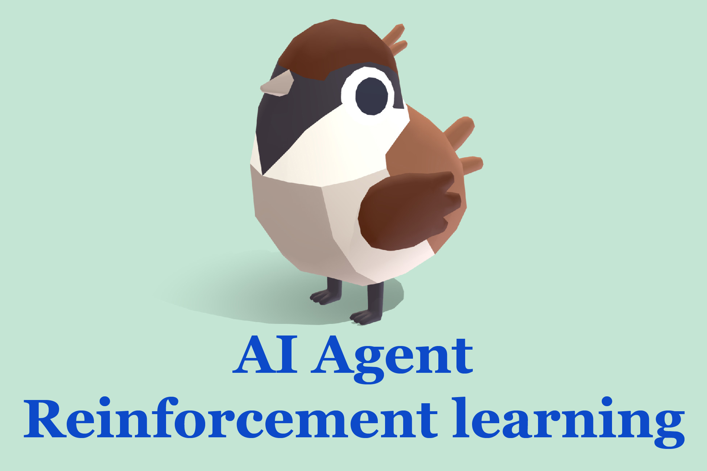

# **AiSparrowAgent Unity3D**

ML model that teaches an agent (sparrow) to collect items (food) and deliver it to final destination (its baby) in artificially created Unity 3D environment. 
Based on reinforcement learning technique.

